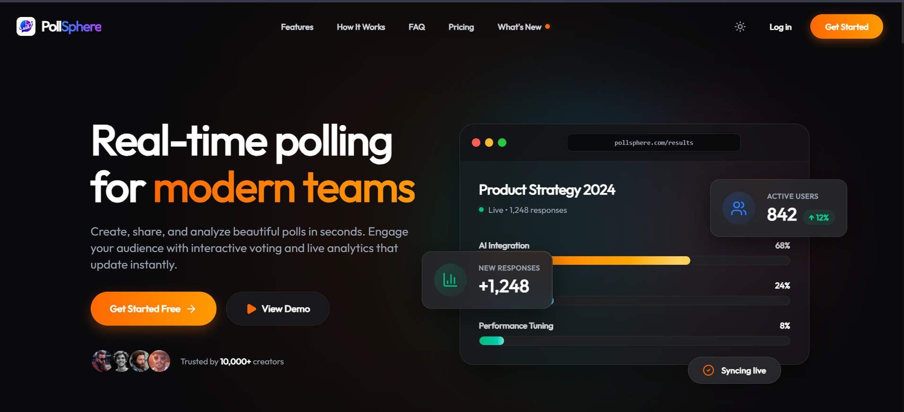
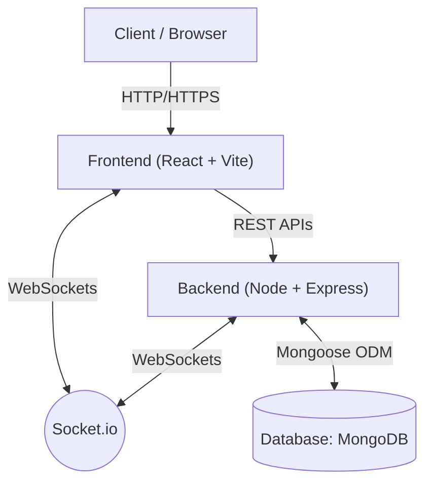

<div align="center">
  
</div>

# 🗳️ PollSphere

> A real-time, interactive polling and live event engagement platform built for seamless audience interaction.


---

## 🚀 Live Demo

- **Live Platform:** [https://pollsphere.peeyushtiwari.online/](https://pollsphere.peeyushtiwari.online/)
- **Live Video Demo:** [Watch on LinkedIn](https://www.linkedin.com/posts/peeyush-tiwari-a4b802319_fullstackdevelopment-webdevelopment-nextjs-activity-7478062522315579394-5ckZ?utm_source=share&utm_medium=member_android&rcm=ACoAAFC-Q1sB70Nh5GBwvPT0avmpakfjWxwwDeA)

---

## 📸 Screenshots / Demo



---

## ✨ Overview

**PollSphere** is a robust, full-stack application designed to empower presenters, educators, and organizers to create live polls and events. It solves the challenge of real-time audience engagement by offering instant feedback mechanisms, secure polling, and comprehensive analytics. Whether it's a quick public vote or a private live event, PollSphere ensures a smooth and dynamic interaction between creators and participants.

---

## ✨ Features

- **🔴 Real-Time Live Events:** Host live events where participants can join via QR code and see polls pushed in real-time using WebSockets.
- **📊 Comprehensive Poll Management:** Create, edit, and manage polls with rich text descriptions (powered by React-Quill).
- **📈 Advanced Analytics & Leaderboards:** Visualize polling data instantly with interactive charts (Recharts) and track participant engagement.
- **🔐 Secure Authentication:** JWT-based user authentication, role-based access, and Google OAuth integration.
- **🛡️ Enterprise-Grade Security:** Built with Helmet, rate limiting, MongoDB sanitization, and XSS protection.
- **🔔 Automated Background Tasks:** Cron jobs ensure timely expiration and closure of active polls.
- **📄 Reporting & Exports:** Generate and download poll results natively as PDFs using PDFKit.

---

## 🛠️ Tech Stack

| Category | Technologies |
| :--- | :--- |
| **Frontend** | React 19, Vite, Tailwind CSS, Framer Motion, React Router v7 |
| **Backend** | Node.js, Express, Socket.io |
| **Database** | MongoDB, Mongoose |
| **Authentication** | JWT, bcrypt, Google OAuth (`@react-oauth/google`) |
| **Security** | Helmet, express-rate-limit, express-mongo-sanitize, xss-clean |
| **State & Forms** | React Hook Form, Zod (validation) |
| **Data Viz** | Recharts, qrcode.react |
| **Utilities** | PDFKit (exports), Nodemailer (emails), node-cron (jobs) |

---

## 🏗️ Architecture



---

## 📂 Project Structure

```text
POLLSPHERE/
├── client/                 # Frontend React application
│   ├── src/
│   │   ├── api/            # Axios instances and API services
│   │   ├── components/     # Reusable UI components
│   │   ├── layouts/        # Dashboard and public page layouts
│   │   ├── pages/          # Application views (Dashboard, Live Events, etc.)
│   │   └── socket/         # Client-side Socket.io configuration
│   └── package.json        # Frontend dependencies
├── server/                 # Backend Node/Express application
│   ├── src/
│   │   ├── common/         # DB config, global middlewares
│   │   ├── modules/        # Domain-driven feature modules (auth, poll, event)
│   │   ├── app.js          # Express app configuration
│   │   ├── server.js       # Entry point
│   │   └── socket.js       # Server-side Socket.io event handling
│   └── package.json        # Backend dependencies
└── README.md
```

---

## ⚙️ Installation & Setup

### Prerequisites
- **Node.js** (v18+ recommended)
- **MongoDB** (Local instance or MongoDB Atlas cluster)

### 1. Clone Repository

```bash
git clone <your-repository-url>
cd POLLSPHERE
```

### 2. Install Dependencies

You'll need to install dependencies for both the client and the server.

**Client:**
```bash
cd client
npm install
```

**Server:**
```bash
cd ../server
npm install
```

### 3. Environment Variables

Create `.env` files in both `client` and `server` directories.

**`server/.env`:**
```env
PORT=5000
MONGODB_URI=your_mongodb_connection_string
JWT_SECRET=your_jwt_secret_key_here
NODE_ENV=development
```

**`client/.env`:**
```env
VITE_API_URL=http://localhost:5000/api
VITE_GOOGLE_CLIENT_ID=your_public_google_client_id_here
```

---

## ▶️ Running Locally

Run both frontend and backend concurrently in separate terminal windows.

**Start the Server:**
```bash
cd server
npm run dev
```

**Start the Client:**
```bash
cd client
npm run dev
```

The client will be available at `http://localhost:5173` and the server at `http://localhost:5000`.

---

## 🔌 API Documentation

The backend exposes organized RESTful endpoints grouped by domain modules:

| Method | Base Endpoint | Description |
| :--- | :--- | :--- |
| **POST** | `/api/auth` | User registration, login, token refresh, and Google OAuth |
| **GET** | `/api/profile` | Retrieve and update authenticated user profile |
| **CRUD** | `/api/polls` | Create, read, update, and manage private polls |
| **GET** | `/api/polls/public` | Retrieve public polls accessible without authentication |
| **POST** | `/api/responses` | Submit and retrieve poll responses |
| **CRUD** | `/api/events` | Manage live events and associated lobbies |
| **WS** | `/api/live` | WebSocket/Live endpoints for real-time engagement |
| **GET** | `/api/analytics` | Fetch real-time metrics, participation rates, and charts |
| **GET** | `/api/dashboard` | Aggregated user stats for the main dashboard |
| **GET** | `/api/notifications` | Fetch system and event notifications |
| **CRUD** | `/api/admin` | Administrative actions (requires elevated privileges) |

---

## 🔐 Authentication & Security

PollSphere is built with security first:
- **JWT Sessions:** Stateless authentication using signed JSON Web Tokens.
- **Protected Routes:** React Router intercepts and redirects unauthenticated users; Express middlewares secure backend endpoints.
- **Data Integrity:** `express-mongo-sanitize` prevents NoSQL injection attacks.
- **XSS Protection:** Output sanitization (DOMPurify on client, `xss-clean` and `sanitize-html` on server) to prevent malicious script injection in rich-text polls.
- **Rate Limiting:** Global API rate limiting (`express-rate-limit`) to prevent brute-force attacks and abuse.

---

## 🧠 Technical Highlights

- **Real-Time Data Flow:** Seamlessly integrates standard REST APIs with Socket.io for immediate UI updates when polls are created, published, or answered.
- **Background Cron Jobs:** Utilizes `node-cron` to automatically process time-sensitive tasks, such as closing polls that have reached their scheduled end date.
- **Dynamic Charting:** Aggregated response data is parsed mathematically on the backend and visualized on the frontend using responsive `recharts` graphs.
- **PDF Generation on the Fly:** Integrates `pdfkit` to compile complex polling data and analytics into a downloadable PDF report natively from the Node server.
- **Modular Backend Architecture:** Embraces a domain-driven structure (`src/modules/*`), keeping routes, controllers, and services cleanly separated for high maintainability.

---

## 📈 Future Improvements

- Add robust unit and integration testing (Jest / Cypress).
- Introduce Redis for real-time leaderboard caching and session management.
- Implement Docker orchestration for simplified one-click deployment.
- Add support for multimedia poll questions (image/video).

---

## 📄 License

This project is licensed under the ISC License.
